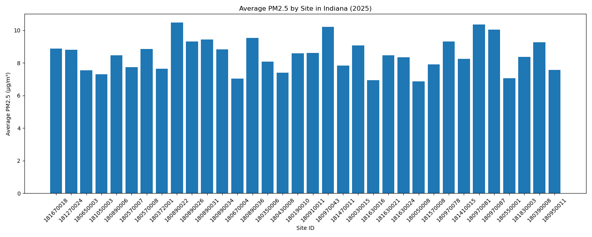
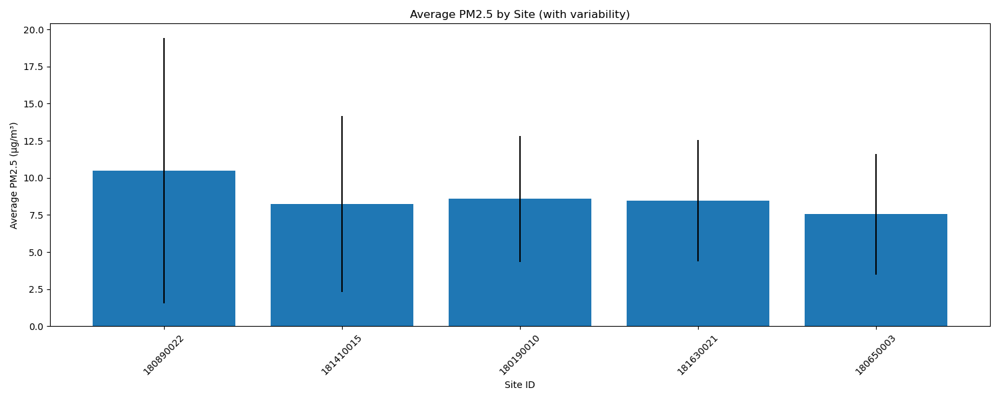
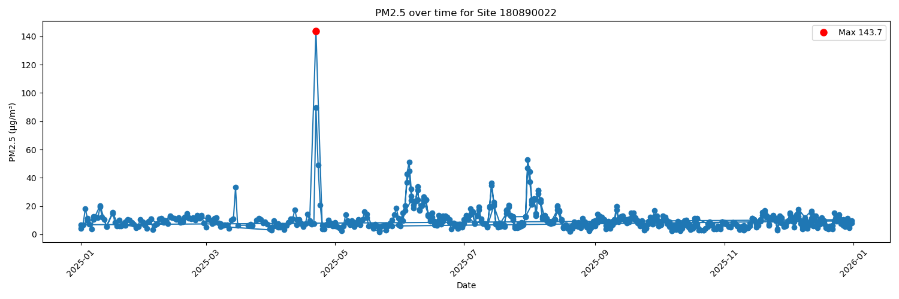

PM2.5 Air Quality Analysis (Indiana, 2025)

Part of a growing portfolio in environmental data analysis using Python.

Project Overview

This project analyses EPA air pollution data to explore air quality trends (PM2.5) in Indiana using Python.

The workflow includes:
•	Data cleaning and validation (pure Python and pandas)
•	Statistical analysis (mean, standard deviation, extreme values)
•	Visualisation (bar plots for averages, line plots for detecting extreme values)

Key Findings:

•	Average PM2.5 levels vary across monitoring sites
•	Extreme pollution events can be identified using standard deviation thresholds

Features

Load and clean EPA air quality data
Handle missing values
Compute:
Average PM2.5 levels over multiple sites
Maximum PM2.5 measurements
Minimum PM2.5 measurements 
Visualise air quality trends using matplotlib
Highlight the sites/dates with the highest anomaly
Exports results to JSON and CSV files

Dataset

The dataset contains EPA PM2.5 measurements for the state of Indiana in the year 2025
Columns used: Date, PM2.5 (Daily Mean PM2.5 Concentration), Site ID

Results & Insights

•	One site (180890022) showed multiple extreme spikes 
•	Highest PM2.5 value observed: 143.7 µg/m³ 
•	Extreme events were rare and concentrated in a small number of sites
•	Most sites exhibited relatively stable PM2.5 levels throughout the year

Visualisations

Average PM2.5 by Site

Average PM2.5 (selected sites), including standard deviation

Extreme PM2.5 anomaly, site 180890022

Technologies Used

Python
pandas
Jupyter Notebook
matplotlib
Git & GitHub

How to Run

Clone the repository
Open the notebook: air_quality_analysis.ipynb
Run all cells

Conclusions

This analysis highlights that while overall PM2.5 levels across Indiana sites remain relatively stable, extreme pollution events do occur and are not evenly distributed.
One site (180890022) showed a significant spike lasting several days, suggesting either local environmental factors or potential measurement anomalies. In contrast, most other sites did not experience such extreme events, indicating that high pollution levels are generally short-lived and location-specific.
The presence of very high outliers (e.g. 143.7 µg/m³) demonstrates the importance of anomaly detection when analysing air quality data, as averages alone can mask these events.

Further investigation could explore:

•	Temporal patterns (seasonality or specific dates) 
•	External factors such as weather events or wildfires 
•	Whether high-variance sites consistently show abnormal behaviour

This project demonstrates how structured data analysis pipelines can be used to move from raw environmental data to meaningful insights and targeted investigation.
